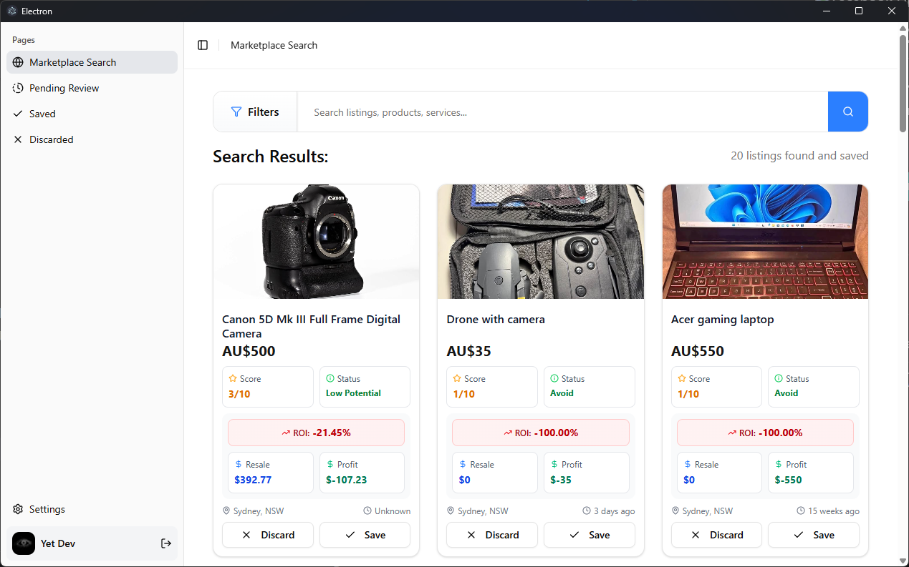
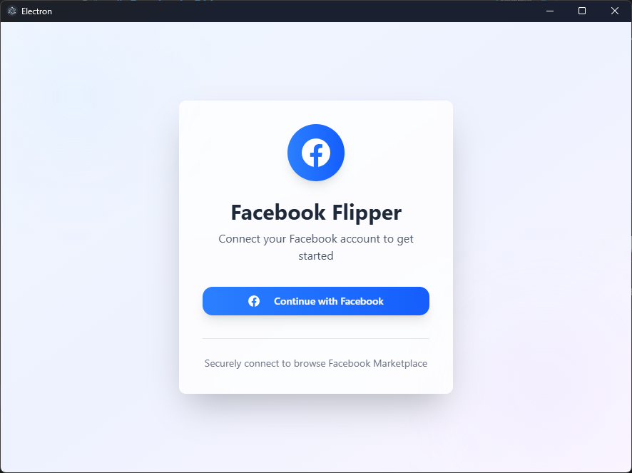
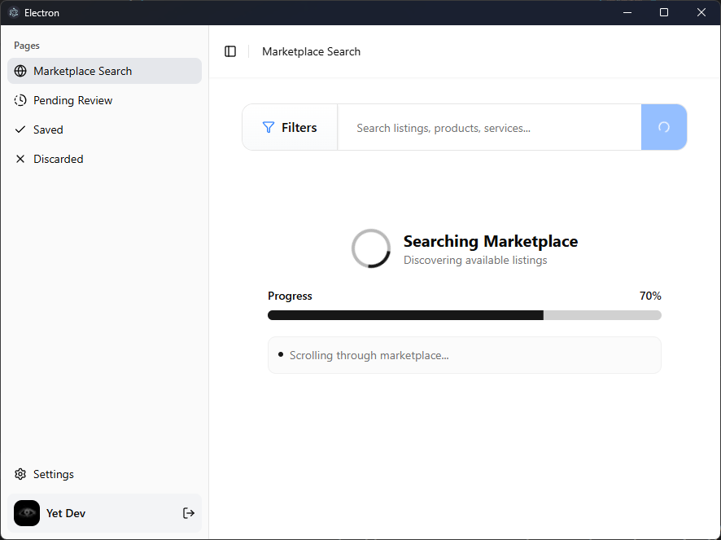
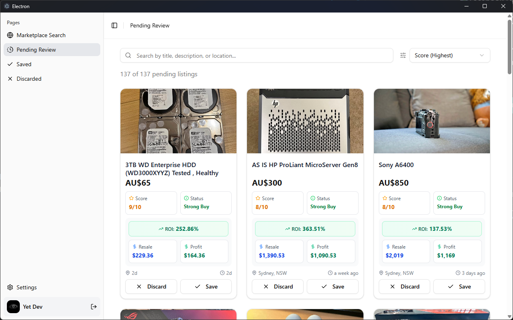

<div align="center">

# Facebook Flipper

**Automate your Facebook Marketplace hunting with AI-powered listing analysis**

[](https://www.typescriptlang.org/)
[](https://reactjs.org/)
[](https://www.electronjs.org/)
[](https://tailwindcss.com/)

</div>

---

<div align="center">
  
</div>

---

## Overview

Facebook Flipper is a powerful desktop application that automates Facebook Marketplace listing discovery and analysis. Using AI-powered intelligent filtering, it helps you find the best deals by automatically scraping, categorizing, and analyzing listings based on your preferences.

### Key Features

- **AI-Powered Analysis** - Leverages OpenAI to intelligently evaluate and categorize listings
- **Automated Scraping** - Uses Playwright to browse and extract Facebook Marketplace listings
- **Local Storage** - All data stored securely on your device using Electron Store
- **Modern UI** - Beautiful, responsive interface built with React and TailwindCSS
- **Secure Authentication** - Direct Facebook login integration
- **Smart Filtering** - Filter and sort listings by relevance, price, and AI recommendations
- **Review System** - Save, discard, or mark listings for review

<div align="center">

  
  
</div>

## Watch the Build Process

Want to see how this project was built? Check out the full development process on YouTube:

[](https://www.youtube.com/watch?v=jqmfUr_3maI)

## Getting Started

### Prerequisites

- **Node.js** (v18 or higher)
- **npm**
- **OpenAI API Key**
- **Google Chrome**
  This project uses Playwright with `channel: "chrome"`, which requires Google Chrome to be installed.
- **Burner Facebook Account (Recommended)**
  It's highly recommended to use a dedicated/burner Facebook account, as automated scraping may violate Facebook's Terms of Service and could result in account restrictions or bans.

### Installation

1. **Clone the repository**

   ```bash
   git clone https://github.com/Jose-AE/facebook-flipper.git
   cd facebook-flipper
   ```

2. **Install dependencies**

   ```bash
   npm install
   ```

3. **Configure environment**
   - Add your OpenAI API key in the settings panel after launching the app

### Development

Run the application in development mode:

```bash
npm run dev
```

This will start the Electron app with hot-reload enabled for both the main process and renderer.

### Building

Build the application for your platform:

```bash
# For Windows
npm run build:win

# For macOS
npm run build:mac

# For Linux
npm run build:linux
```

The built application will be available in the `dist/` directory.

## Usage

1. **Login to Facebook**
   - Launch the app and authenticate with your Facebook account
   - Your session is securely stored locally

2. **Search for Listings**
   - Enter keywords and location in the search bar
   - Set your price range and filters
   - Let the AI analyze and categorize results

3. **Review Results**
   - Browse AI-recommended listings
   - Save items you're interested in
   - Discard irrelevant listings
   - Mark items for further review

4. **Manage Your Collection**
   - View saved listings
   - Track pending reviews
   - Access discarded items

## Contributing

Contributions are welcome! Please feel free to submit a Pull Request.

## License

This project is for educational purposes only. Please ensure you comply with Facebook's Terms of Service and use this tool responsibly.

## Disclaimer

⚠️ **Important**: This tool is intended for educational and personal use only.

- **Account Risk**: Facebook may detect automated activity and restrict or permanently ban your account. It is **strongly recommended** to use a burner/throwaway Facebook account.
- **Terms of Service**: Using this tool may violate Facebook's Terms of Service.
- **No Liability**: The author is not responsible for any account bans, restrictions, or other consequences resulting from the use of this tool.

Always respect data privacy and platform policies. Use at your own risk.
